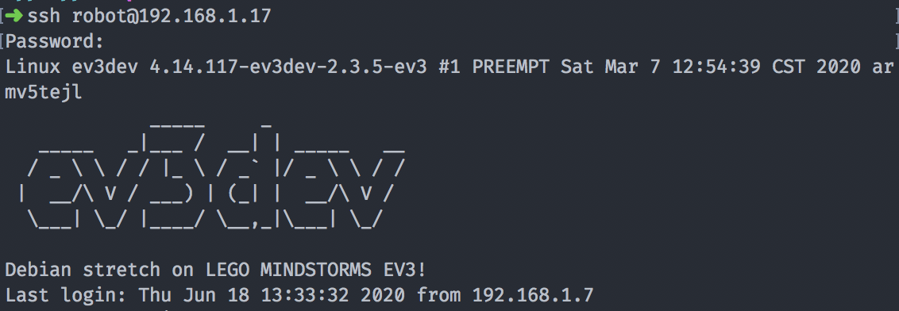
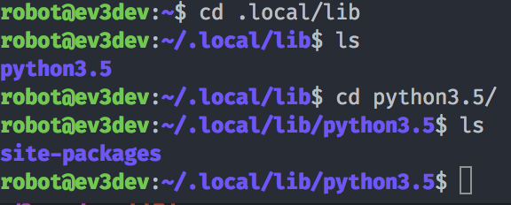
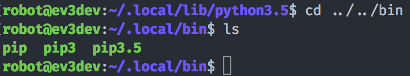

# How to get the Onshape Python Client (and pip3) installed on your EV3

Welcome to the tutorial! If you have a Lego EV3 with a Wifi card and want to send API calls to Onshape, this is the place for you! 

## Let's begin 
With your EV3 turned on, open up a Terminal and `ssh` to your IP address listed on the upper right hand corner of your EV3. 

You'll see ASCII art for ev3dev if you're doing this part correctly. All further commands will be done as the user robot within the EV3's file system.

## Getting pip3 installed 

Type in `curl https://bootstrap.pypa.io/get-pip.py -o get-pip.py` and get-pip.py will magically appear in your current working directory (you can check with `ls`). 

Once you have get-pip.py downloaded, there are a couple options you can try to help pip run faster. I recommend running `python3 get-pip.py --no-wheel` to install pip3 with setuptools but no wheel. If you want an even faster running pip minus setuptools, try `python3 get-pip.py --no-wheel --no-setuptools`. If you want all the goodies that come with pip, but want to wait 45 minutes for your package to install, go right ahead with `python3 get-pip.py`

## After install: 
Once you have waited the average 15 minutes to install pip3 on your EV3, there could be a warning that looks like this: 

``
WARNING: The script chardetect is installed in '/home/robot/.local/bin' which is not on PATH.
  Consider adding this directory to PATH or, if you prefer to suppress this warning, use --no-warn-script-location.
    Running setup.py install for ruamel.yaml.clib ... done
``

If you're not going to use pip3 a lot and want pip3 to be installed there (with the rest of it's packages), just add `/home/robot/.local/bin` to your path with the command: 

`export PATH=$PATH:/home/robot/.local/bin`

If you start installing using pip3, all of the packages will live inside `/home/robot/.local/lib/python3.5/site-packages`. 

**Warning:** If you go this route, you might have some issues with modules not being found. Even though the next part is a bit tricky, I do recommend moving pip3 to `/usr/local/lib`

## If you don't want pip3 inside .local:
If you want pip3 inside .local, skip this part. 

This is where the fun begins. My EV3-dev comes with python3.5 installed inside `/usr/local/lib`. I'd suggest navigating there with `cd /usr/local/lib` and `ls` to find python3.5 (or your other python3 version). If it's there, `cd` inside and check to see if the folder `dist-packages` exists. 

With that check complete, `cd ~` or `cd` to get back to your home directory, and let's take a look within `.local/lib`...

If site-packages exists, let's check if the executables for pip exist in `~/.local/bin`:

Check to see where pip3 resides by typing in `which pip3`. If `/usr/bin/pip3` pops up, you're in good shape. If not, let's quickly switch over to the root user with `sudo su` and copy over the executable `pip3` with the command `cp ~/.local/bin/pip3 /usr/bin/`. 

While in root, we will also copy over the directory `site-packages` with the command `cp -r ~/.local/lib/site-packages /usr/local/lib/python3.5/` 

You have done this part correctly if you `cd` back to `/usr/local/lib/python3.5` and the folder `site-packages` exists. 

Let's finish up by `cd /usr/local/lib/python3.5/site-packages` and `touch pip.ini` 

Within `nano` or `vim`, open up `pip.ini` and type in: 

``[global]
target=/usr/local/lib/python3.5/site-packages
``

This will reroute pip3 installs to the python3 site-packages folder. 

To exit out of root, `sudo su` again. 

## Install onshape_client with pip3

Simply `cd` and type in `pip3 install onshape-client` 

## Setting up your .yaml file with configuration

Create a file in your home directory called `.onshape_client_config.yaml` 

Here is the boilerplate code: 
``
prod_api_keys:
  base_url: "https://cad.onshape.com"
  secret_key: YOUR SECRET KEY
  access_key: YOUR ACCESS KEY
default_stack: prod_api_keys
``

Fill in your API secret key and access key here, change the base url to an enterprise one if you have an enterprise account.

## Congratulations! 
