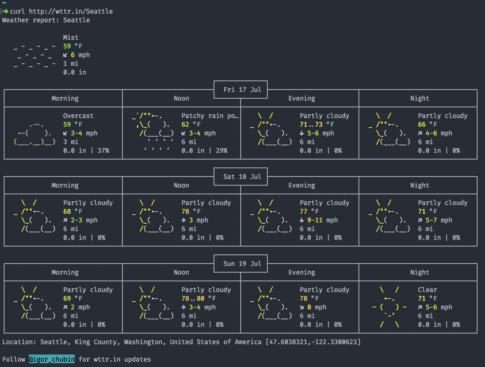
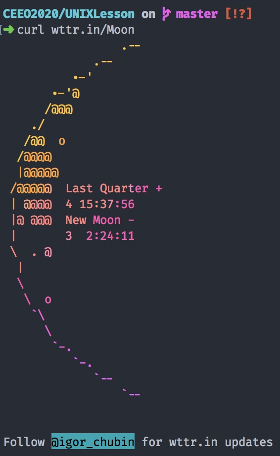
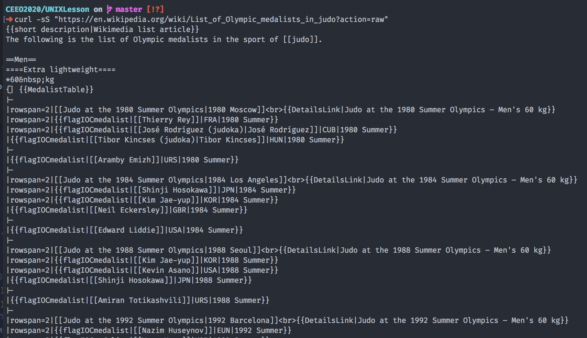
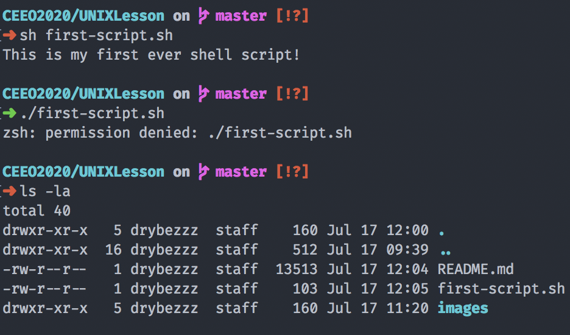
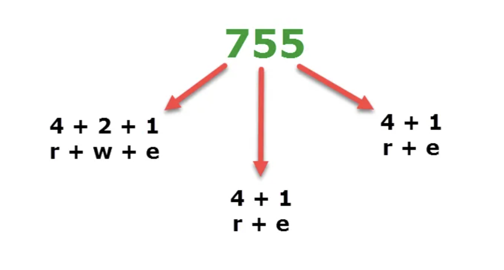
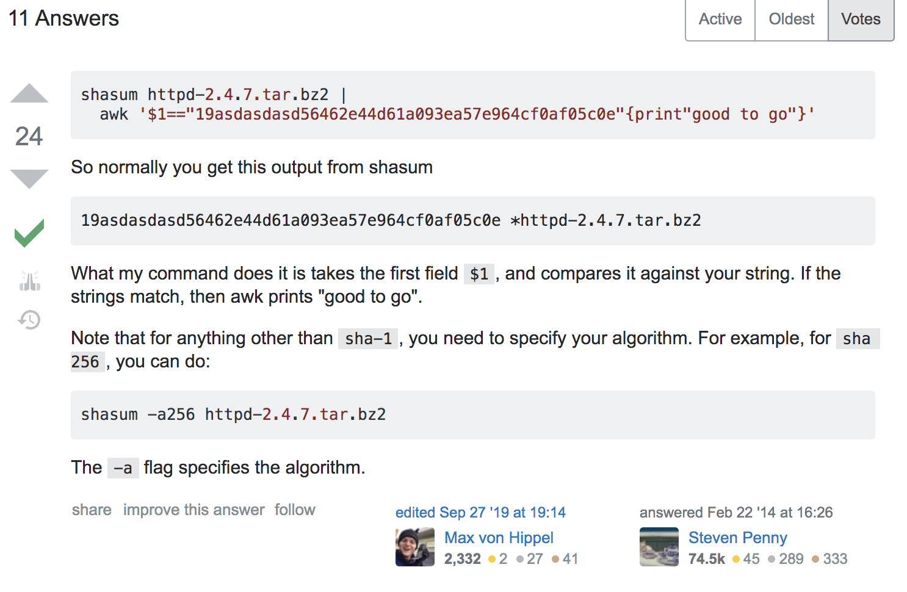

# Welcome to the UNIX Tutorial/Workshop! 

This README will help you navigate your way through Unix-like machines, and for people already familiar with working with Terminal/`sh`, a set of challenges to try out and work on new bash skills. If you think you're a pro, try out some [challenges](#challenges) and skip my massive wall of text. 

## For PC users that want to try this out but don't want to dual-boot/get a VM/emulate: 

Try out https://cocalc.com/ or https://bellard.org/jslinux/. These online Unix emulators allow you to experience some basic functionality so you can follow along. 

## Table of Contents 

1. [Cheat Sheet](#cheat-sheet)
2. [Writing your first Shell Script](#your-first-shell-script)
3. [Permissions](#permissions)
4. [Compression](#compression)
5. [Test Your Knowledge](#test-your-knowledge)
6. [Challenges](#challenges)
7. [Extra Resources and Further Hacking](#extra-resources-and-further-hacking)

### A quick aside...

If you ever have any issues with a command, or don't know where to look for, there's tons of resources online to help out! Here are a couple: https://www.techonthenet.com/unix/index.php, https://files.fosswire.com/2007/08/fwunixref.pdf, http://www.mathcs.emory.edu/~valerie/courses/fall10/155/resources/unix_cheatsheet.html and obviously [stack overflow](https://www.youtube.com/watch?v=dQw4w9WgXcQ) has all the answers to your questions. 

As I'm making this guide, I'm watching ASCII Star Wars in my Terminal by typing the command  `telnet towel.blinkenlights.nl`. Feel free to give it a watch **AFTER** the lesson.

## Cheat Sheet  

Below is a list of commands and respective flags that you should have in your toolbox. Use this cheat sheet when solving problems listed [below](#your-first-shell-script). 

- **`ls`**: list all files (within your current directory). You can also list files in a specified folder name with `ls path/to/your/folder/here/` 
    * **`-a`**: Display all files, even hidden ones (that start with a period -> .gitignore)
    * **`-l`**: Display files in long format, with permissions 
    * **`-r`**: Display files in reverse order 
    * **`-u`**: Display files by access time 
    * **`-R`**: Display all subfolders and their respective files in an organized fashion

**Note:** You can mix and match `ls` **and most other** command flags to fulfill your craziest wishes. If you need to list all files and their subfolders in long format, while also filtering them by access time, you can do that with `ls -laRu` or `ls -l -a -R -u` 

- **`cd`**: Change directory. Moves a hypothetical pointer of where your Terminal window is currently working in to a specified folder. **All commands that you execute require for you to be in the proper working directory and understand the file-structure.** This is probably the most used command other than `ls`. Examples: `cd ~` -> change to home directory. `cd ..` -> change to the parent directory. `cd /path/to/folder` -> change your working directory to the folder specified. Simply typing `cd` will change you back to the home directory.

- **`pwd`**: Print working directory. If you don't know where you currently are, simply type in `pwd` and it will print something like `/Users/your_username_here/path/that/you/got/stuck/in/and/now/you/don't/know/where/you/are/`. You can then use `cd` to get back to the home directory or chain `cd ../../../../..` to move back (in this case) 5 parent directories. The amount of `..` indicates the amount of parent directories you're jumping up. 

**Pro Hacker Move:** If you have a couple hours, bored with your life, and are browsing insecure websites, real-life hacking awaits! In a form that you think potentially doesn't scrub its input, you can type in a set of chaining `../` and `/etc/shadow` to try and get the server to respond with a list of password hashes. You could try and crash our own Onshape App if you'd like (good luck)! For example, an attempt could be `../../../../../../etc/shadow`. If you don't have a form, you can still query the server with a well-crafted [URI](https://en.wikipedia.org/wiki/URI_scheme). Example: `http://example.com/../../../../../../etc/shadow` or `http://target/..%u2216..%u2216directory/file` to get through servers that scrub Unicode encoded characters. Remember, ethical hacking is ok, but doing this stuff on real websites is illegal. However, you can always message the site and tell them that you're a security expert and successfuly found the list of credit cards they're improperly storing in order to recieve a nice payout. I'd recommend not doing that unless you know what you're doing. Instead, test your hacker skills by spinning up your own server! 

- **`mv`**: Move or rename a file. Example: `mv file-that-should-be-somewhere-else.txt ../here` will move the file up one directory to a folder named `here`
    * **`-v`**: Verbose output, basically has `mv` explain what's being done. Useful for debugging a faulty `mv` command 
    * **`-f`**: Allows you to forcefully move source files to a destination folder. Basically forces the move without a prompt asking if it's ok to overwrite files with the same names. Useful when you know the contents inside a folder are useless.

    Examples: `mv file1.txt my-api-keys 5G_corona_build.pkg backdoor-to-nsa.sh file5.tsx ~/Documents` moves all files to the Documents folder (the `~` is a shortcut for your home directory).

- **`man`**: Your dedicated manual. Type in `man any-executable` and it will give you documentation that the authors of the script wrote. Press q to quit

**Tip:** If you don't know what commands you have, go ahead and `ls /bin` to see what default commands come with your distribution of Terminal. Use `ls /usr/local/bin` to see any extra commands that you've downloaded over the years. If you have `brew` installed, you can check the executables you downloaded with `brew list`. You can also `man brew`. Try and `man` something, you'll learn a couple new tricks. Everything is manpageable! 

- **`cp` and `scp`**: Copy a file or directory. Sort of like `mv` but you keep the original source files/folders. `scp` is used if you need to copy stuff to a remote directory (for example, a homework server or an AWS instance that you have to get to by running `ssh`) and has basically the same functionality as `cp`
	* **`-r`**: Recursive, copy directories and all sub-files (and folders). Example: `cp -r my_folder1 ~/Downloads` **copies** my_folder1 and all its contents to the Downloads folder. 
    * `scp` example: `scp robot@117.8.2.4:~/Documents/main.py .` will first prompt you for your password for the `ssh` instance and then copy over the file `main.py` from your Lego EV3 to the current working directory (that's what the `.` is doing)

- **`rm`**: **WARNING:** this command will remove and permanently delete files from your machine. Use with extreme caution. 
    * **`-r`**: Recursive, delete the directory and all of its contents. Example: `rm -r my-past-mistakes/` to remove the directory `my-past-mistakes`. It does not go to your Trash bin, its bits will forever dissolve into the aether. 
    * **`-f`**: Forcibly remove contents, without prompting for user permission. A common tactic to make new enemies is to go over to an unsuspecting person and type `rm -rf *` into their Terminal to promptly delete everything (More on * functionality later). If you're smart, you will use `chmod` to remove execute permissions of the folder.

- **`chmod`**: Change permission of a file or directory. More information on usage in [Permissions](#permissions)

- **`sudo`**: Your go to root command. If you need elevated permission to view, execute, or read files, precede a command with `sudo`. You will be prompted to type in your password. Example: `sudo mv restricted-file restricted-directory` will move a restricted file to a restricted directory. If you need to switch to root, type in `sudo su` (don't forget to switch back out by running the same command). 

- **`cat`**: Print out a file's contents. Example: `cat main.py` will output your genius code to the terminal. If you want to redirect the output to a new file, try `cat main.py > new_file.txt` or append with `cat main.py >> logs`. 

- **`diff`**: Find the differences of two files. Example `diff text1.txt text2.txt` will print out all of the lines that are different. Useful when you're writing tests (with correct answers) and checking your script output to see if your code is correct. 

- **`zip`, `unzip`, `gunzip`, `tar`**: Zipping and unzipping files the Terminal way. More info in [Compression](#compression)

- **`curl`**: Your very own postman! Query stuff online. Useful tips [here](https://curl.haxx.se/docs/manual.html). Example: `curl http://wttr.in/LOCATION` to find out the weather in LOCATION (Try `curl http://wttr.in/Boston`). You can flex on Chris Rogers by crafting a SystemLink POST call with curl (I won't give you the answer, this one's on you). 
    * **`-h` or `--header`**: Craft your own API header. Example: `curl --header 'content-type: application/json'` 
    * **`--request`**: Specify the request method. Example: `curl --request GET --url http://blah-blah.com`
    * **`--url`**: The url you want to send a cURL to. 
    * **`-s`**: silent mode.
    * **`-S`**: Show errors. 
    Example: `curl -sS "https://en.wikipedia.org/wiki/List_of_Olympic_medalists_in_judo?action=raw"` allows you to view the list of olympic medalists in judo. Check the bottom of the cheat sheet to see the output of several cURL commands. 

- **`touch`**: Create a file! Example: `touch this-is-so-cool.png` to create an empty .png file. You can even specify the path to create a file.

- **`echo`**: Print the following string to the terminal. Example: `echo "wow"` will output wow to the terminal. You can use `>`, `>>`, and `|` operators to pipe the echo output to another script. 

- **`which`**: Outputs a path to your executable. Example: `which python3` will display the location of the executable `python3`. 

- **`nano` or `emacs` or `vim`**: Text editors in the Terminal! Each one has their own niche, so choose wisely. I personally love `vim`, so if you have any questions and want to learn more, feel free to AMA. Typing in `nano file.txt` or `emacs file.txt` or `vim file.txt` will open up the file in the respective text editor. If you don't have any of these, try `brew install` for OS X or `sudo apt-get install` if you're a Linux user. 


If you don't believe in the powers of cURL, I've taken the freedom to try out some of the commands for you. Here's the output: 

  

## Your First Shell Script

Let's write your first shell script together! Every `sh` script starts off with a [shebang](https://en.wikipedia.org/wiki/Shebang_(Unix)), followed by a path to an executable that looks like this: `#!/usr/bin/sh` or `#!/bin/sh`. If you don't know where `sh` is in your machine, type `which sh` and it will output a path for you. The shebang is actually the `#!` that signals to the program loader that the following file is indeed an executable and it should find the executable path to run the script (which is `/bin/sh` for my machine). Once you have `#!/bin/sh` (or your own path) written as the first line, it's time to write some code! 

I've outlined how to use conditionals, for loops, querying for arguments, and other useful information in `first-script.sh` found at the [top](https://github.com/drybell/CEEO2020/tree/master/UNIXLesson) of this page. You can run shell scripts in two ways: `sh first-script.sh` or `./first-script.sh`. The second method only works if you `chmod` the executable and raise permissions to run, so let's stick with the first method and learn about [permissions](#permissions) later. If you like, I recommend downloading/copying `first-script.sh`, reading the source (there's some comments to help you understand), and trying to manipulate the code to do other things. If you feel comfortable, you can try out the challenges or answer some questions below. I'm following https://www.shellscript.sh/ tutorials to help me structure code. If you're stuck and confused, they do a great job explaining the finer details of shell scripting, so give their articles a read.

## Permissions

If you remember in the previous section, trying to run `./first-script.sh` causes the terminal to bark back: `permission denied`. In this section, you'll learn how permissions work in a UNIX machine and how to modify them. Finishing this section will allow you to solve some problems in [Test Your Knowledge](#test-your-knowledge). Take a look at the terminal output below:



As you can see, running the `./` method returns `permission denied`. Typing in `ls -la` allows me to see that `first-script.sh` has permissions `-rw-r--r--`. What does a permission mean? Let's break it down. 

There are three types of permissions: 
    - **r** -> Read permission
    - **w** -> Write permission
    - **x** -> Execute permission

And a classification of users: 
    - **u** -> User (yourself)
    - **g** -> Group (example: sudo staff. treat this classification as a group of users with a set permission class)
    - **o** -> Others 

Using `ls -l` allows you to see permissions of each file and folder in this weird `-rw-r--r--` format. Let's revisit the example in the picture above. 

```
-rw-r--r--   1 drybezzz  staff  13513 Jul 17 12:04 README.md
-rw-r--r--   1 drybezzz  staff    103 Jul 17 12:05 first-script.sh
drwxr-xr-x   5 drybezzz  staff    160 Jul 17 11:20 images
```

From left to right, `ls -l` displays the permissions, the number of links to the file/folder, the owner, the owner's group, the size in bytes, the time/date it was last modified, and the name of the file itself (don't pay attention to when I was writing this whole thing) . We are going to be focusing our attention to the first column. 

I'm going to break down the permissions (1st column) of the above terminal output to make them easier to read. We read the 2nd to the 10th position of each string (the first letter indicates if the permission is set to a **file** (-) or a **directory** (d)): 

```
file?   (user - group - other)  links  ...   name
          u       g       o       
 -       rw-     r--     r--      1        README.md
 -       rw-     r--     r--      1        first-script.sh
 d       rwx     r-x     r-x      5        images/
```

The last one, images/, is a directory so the d tag is set as the first letter. 

Let's remove all the extraneous details and focus on the 3 sets of 3: 

```
(user - group - other)  
  u       g       o       
 rw-     r--     r--    README.md 
 rw-     r--     r--    first-script.sh 
 rwx     r-x     r-x    images/
```

If you haven't noticed already, when we're not counting the initial bit, the first three letters are permissions set for the user (you), the next three are set for the user's group, and the last three are set for the others.

Get ready for a little bit of math, for I will now convert this data into binary, and then to octal ([what is octal?](https://en.wikipedia.org/wiki/Octal)):

```
(user - group - other)  
  u       g       o    
 110     100     100    README.md
 110     100     100    first-script.sh
 111     101     101    images/
```

```
(user - group - other)  
  u       g       o    
  6       4       4     README.md
  6       4       4     first-script.sh
  7       5       5     images/
```

Now here comes the magic, if I want to retreive the correct `chmod` command to set the user permissions exactly as they are for these 3 files/folders, it would look like this: 

```
chmod 644 README.md
chmod 644 first-script.sh
chmod 755 images/
```

Do you see the similarity? Here's another way to break down the way you can set user permissions: 

```
Read    --> 4 
Write   --> 2
Execute --> 1 
```

In other words, the read permission is represented as the **Octal digit 4**, the write permission is represented as the **Octal digit 2**, and the execute permission is represented as the **Octal digit 1**. 

These numbers, when stacked together, form the user, group, and other permissions that the file/folder has. 

Here's a picture I stole from https://helpdeskgeek.com/linux-tips/understanding-linux-permissions-chmod-usage/ that explains this in a graphic way:



Let's run through an example before we move on to compression: 

I will be using the hypothetical file `test.py`. 

If I wanted to give the **user** read, write, and execute permission, and the other two (group and other) only read permission, I will write `chmod 744 test.py`. If instead I wanted to give the **owner group** the max permissions, with user and other set to only read, I'll do `chmod 474 test.py`. 

## Compression

This will be a quick overview of zipping and unzipping files, and the filetypes that UNIX systems can identify. The most common types are .zip, .gz, .tar., .gzip. 

If a file ends in `.tar`, you'll use the `tar` command, while files ending in `.gzip` or `.gz` will need `gunzip`. `.zip` files need `unzip`. 

To uncompress a .zip file, type in `unzip myfile.zip`. Try it next time someone sends you a zipped folder. 

`tar -xvf filename.tar` to unzip tarballs. `gunzip file.tar.gz` and then `tar -xvf file.tar` to unzip a .gz or .gzip file.

To compress a tar file, here's the syntax: `tar -cvzf scheduler.tar.gz scheduler`. If you have a folder called scheduler, you can compress it to scheduler.tar.gz by using the flags `-c -v -z -f` 

Here's a quick rundown on the `tar` flags (from https://mkyong.com/linux/how-to-zip-unzip-tar-in-unix-linux/): 
```
c = create a new tar file
v = verbose , display file to compress or uncompress
f = create the tar file with filename provided as the argument
z = use gzip to zip it
x = extract file
```

To compress a zip, run `zip -r archive_name.zip folder_to_compress` in order to turn folder_to_compress to `archive_name.zip`. 

**NOTE:** If you see something called a **checksum** when you're downloading random things off the internet, you're looking at the secure summed up value of the contents of a zipped file. The reason why some websites show checksums is because of **hackers** sabotaging connections and sending you something that looks like the zip you just downloaded, but filled to the brim with malware. In order to check for these kinds of things, you can use the commend `shasum`. I'll spare you the details, but a [stack-overflow](https://stackoverflow.com/questions/21956954/how-to-check-the-checksum-through-commandline) user answers this quite well (and gives you an easy script to *borrow* for your own use): 



## Test Your Knowledge

This section will pose some problems for you to solve. If you're stuck, check out [Cheat Sheet](#cheat-sheet), [Permissions](#permissions), or [Compression](#compression) as these problems are directly tied to the previous sections.

1. What is the necessary `chmod` command needed to execute `first-script.sh` like so: `./first-script.sh`. What does the permission look like? 

2. What is the command to print "Hello World" to the terminal? 

3. What is the shebang? Type it out.

4. What is the letter in a file's permission that signifies the entry is a folder?

5. What is the highest level of permission `chmod` can be set for a user, group, and other? How will it look in `rwx` form? 

6. How would I move a folder named `myfolder` and all its contents to `~/Documents`? 

7. What command(s) do I run in order to unzip a .gz file? 


At the end of this session, please submit your anonymous answers to this google form: https://forms.gle/bUybNV93oW2qhBtq5

## Challenges

1. Learn about `crontab` and `cron` [here](https://www.ostechnix.com/a-beginners-guide-to-cron-jobs/). Make a shell script that curls the weather in Abu Dhabi and outputs to a file named `weather-in-abu-dhabi` every 5 minutes. Try and append future output to the same file (and not overwriting the previous output). If you don't want this to run forever, you can use `crontab -e` in order to modify the list of running cronjobs. Deleting a line will allow you to remove the task from running ever again. Another direction for this script could involve asking for the weather in any location and the script will output the answer for you. Some example usage could look like this: `./whatstheweatherin Boston` 

2. Make a shell script that organizes your Desktop! Figure out the necessary folders and the naming conventions that you want. For myself, I usually take a lot of screenshots and have them cluttered all over the Desktop. To fix this, I wrote a script and made it a cronjob to always move screen shots to a specified folder. 

3. There's a command called `date` which prints out boring date and time. Write an upgraded `date` called `upgraded-date.sh` that allows you to see the time in multiple date-time formats, your current time zone, day of the week, etc. 

4. Write a script to unzip files from a source folder and send the unzipped folder to a specified location. Example usage: `./my_unzipper Downloads/text.tar.gz CEEO2020/downloads`.
Allow multiple zip types for a more robust unzipper. 

5. Write a simple guessing game script where the objective is for the user to guess a randomly generated number. Sample usage: 

```
sh guessing-game.sh
Hello, I have chosen a number from 0-100. Try to guess it.
Guess 1 >>> 10

Higher

Guess 2 >>> 90

Lower 

Guess 3 >>> 50

Higher

Guess 4 >>> 66 

Correct! It took you 4 guesses!
```
If that's too easy for you, try and add a high score count 

## Extra Resources and Further Hacking

I love finding new tools to `brew install`, and have compiled a list of fun scripts for you to try out on your own. 
- `tree` allows you to visualize your current working directory and all of its subfolders in a nice ASCII art fashion. 
- `weechat` allows you to join IRC channels. Chat away with other developers in your Terminal! Who needs slack or discord. 
- Psst... jealous of my decked out terminal? Go ahead and download https://ohmyz.sh/ to get your outdated terminal a snazzy new look.
- If you always use multiple terminals and need a better way of managing them, try out tmux! `brew install tmux` if you dare. 